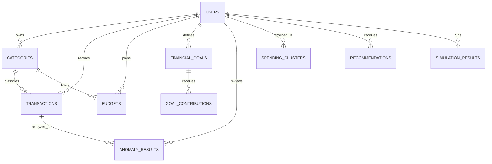

# FutureFinance ER diagram

```mermaid
erDiagram
  USERS ||--o{ CATEGORIES : owns
  USERS ||--o{ TRANSACTIONS : records
  CATEGORIES ||--o{ TRANSACTIONS : classifies
  USERS ||--o{ BUDGETS : plans
  CATEGORIES ||--o{ BUDGETS : limits
  USERS ||--o{ FINANCIAL_GOALS : defines
  FINANCIAL_GOALS ||--o{ GOAL_CONTRIBUTIONS : receives
  USERS ||--o{ ANOMALY_RESULTS : reviews
  TRANSACTIONS ||--o{ ANOMALY_RESULTS : analyzed_as
  USERS ||--o{ SPENDING_CLUSTERS : grouped_in
  USERS ||--o{ RECOMMENDATIONS : receives
  USERS ||--o{ SIMULATION_RESULTS : runs
```
